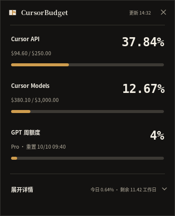
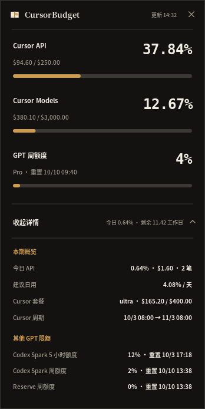

# Quiet Ledger

CursorBudget 1.2 uses a compact, three-signal hierarchy. Cursor API, Cursor Models, and GPT weekly usage are the only figures visible at rest. Each receives the same vertical rhythm: a plain label, a right-aligned tabular percentage, one line of evidence, and a restrained meter. Nothing else competes for first glance.

Secondary accounting belongs behind progressive disclosure. Today’s API spend, the suggested daily pace, plan and cycle metadata, and additional GPT windows appear only after the user selects “展开详情”. The card therefore works as both a calm ambient instrument and a complete ledger without forcing both modes into the same view.

The surface is warm graphite or porcelain rather than pure black or white. One muted brass accent carries normal state; a quiet red is reserved for a genuine warning. There are no decorative gradients, left-edge ribbons, neon telemetry colors, card stacks, or ornamental shadows. Hairlines separate phases, not every datum.

Typography has three jobs. A serif face gives the small product name identity, a CJK sans-serif keeps labels and evidence quiet, and a monospaced figure face makes percentages stable while they update. GPT percentages display only the precision returned by the service—`1%`, not `1.00%`—while Cursor’s genuinely fractional values retain two decimal places.

The collapsed logical canvas is 348 × 430. The expanded canvas grows vertically in place, preserving width and the three primary rows. The GNOME panel and editor companion follow the same hierarchy using `A`, `C`, and `G` as compact labels.

